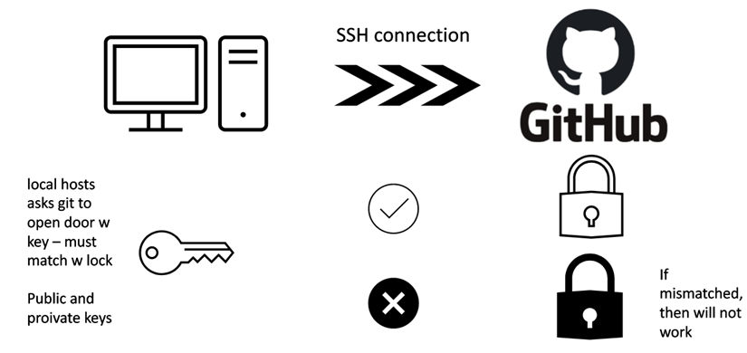
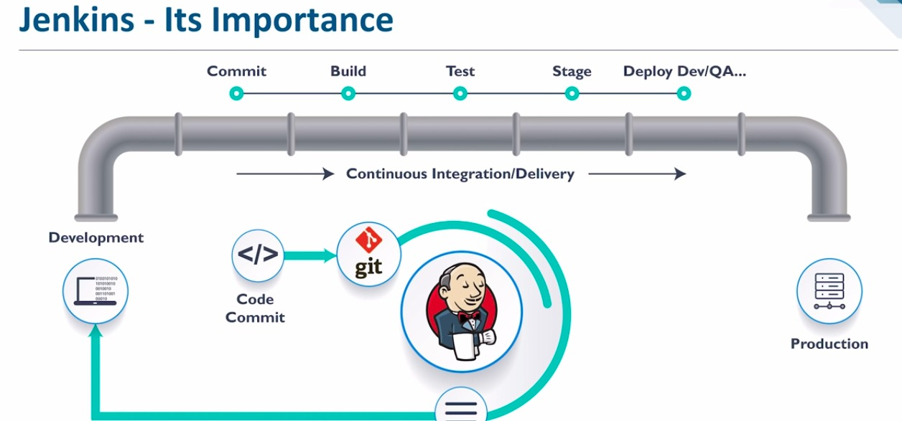
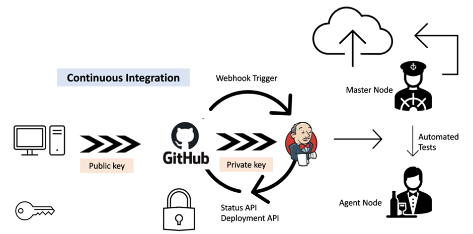

# SSH Setup Between Localhost and Github



## Generating SSH Keys and Deploying .pub Key to GitHub

1. In ~/.ssh folder:
```bash
ssh-keygen -t rsa -b 4096 -C "email Id used for git hub"
```
- Type nothing in all the entries

2. Go to settings on GitHub and select `SSH GPG Keys`

3. Create new ssh key

4. Go back to local host and code: 
``` bash
cat id_rsa.pub
```
5. Paste in github and add -->
**secure connection established**

6. Create new repo and select SSH on setup page




<br><br>

# CICD



## Jenkins
### *Setting up a New Project in Jenkins*

1. In the main Jenkins menu, select `create new item`

2. Submit a name and select `Freestyle Project`

3. In the next menu;
`Discard old builds` --> keep 3 interations 
`Build execute shell` and input:
```bash
uname -a
```

4. Apply and save changes

5. Click on project --> `Build now`

6. Select the completed job and `Console output` 

### *Finding Location in Jenkins*

1. Create new item with same settings as original Jenkins project

2. Change the code in the shell:
```bash
pwd
```
3. Apply and save changes

4. Click on project --> `Build now`

5. Select the completed job and `Console output`

## Creating a Pipeline
- click configure in first job
- post-build action --> build other projects
- type in sewcond project and trigger if build is stable
- click on build now

**TASKS:**
- Generate a new SSH key called sre_jenkins (when prompted to name file)
- Create new repo with working code from app
- create new repo (from existing code)
- deploy .pub key to github and private key into Jenkins


- on repo w working code click settings add deploy key

## Connecting GitHub and Deploying Private Key to Jenkins

- create new item --> freestyle
- description, discard, github project --> input HTTPS from Code section of git repo
- restrict where priject (sparta-ubuntu-node) can run under Office 365 Connector section
- Source Code Management: click git
    - repository URL --> SSH for Github repo
    - credentials --> add private key from ssh folder (one without any extentions)(include everything)
    Kind: SSH username w private key
    add description
    - give key name select key from crediential
    branch specifier --> change master to main 
Build Triggers
click GitHub hook trigger for GITScm polling	

Build Environment
click Provide Node & npm bin/ folder to PATH	

Build
```bash
cd app
npm install
npm test
```
Apply and Save
Build now

## Add a Webhook to Jenkins
- in git repo click settings then webhooks
- payload URL - Jenkins environment URL + /github-webhook/
- Content type: application/json
- no Secrets
- Events: send me everything

**TASKS:**
- Create Dev branch (change main to dev)--> push
- Create webhook in github to trigger w every commit/push from local host to trigger this job
- in post build actions, trigger another job to merge code into main
- second job will only be triggered if test passes
- create third job for cd/cde on AWS from Jenkins
- Jenkins copies code to ec2 instance
- launch app on public IP
- ec2 security group to allow ssh port 22 to jenkins ip

## Testing From Dev Branch
Create new item with same settings as original GitHub-Jenkins project

Change/Edit the following -

***Branches to Build:*** 
**Branch Specifier:** */dev

## Merging Code to Main with Jenkins

Create new item with same settings as original GitHub-Jenkins project

Change/Edit the following - 

**Source Code Management:** *Branches to Build:* Branch Specifier: */dev

**Additional Behaviours:**

Merge before build

Name of repostiory: origin
Branch to merge to: main

***Post-build Actions:***
**Git publisher:**
- Select: Push only if build succeeds
- Select: Merge results

## Copying to EC2 Instance with Jenkins

### N/A

<br>

#### TO RESEARCH:

- What is staging (in regards to Jenkins)? **not every edit is saved --> must be added and committed
**staging area** is a state of limbo between commiting and pushing to GiitHub --> is in users' control
once pushed it connot be brought back
git reset to go back
same applies to Jenkins**

- How does Jenkins beenfit a company?
- What are the stages in Jenkins?
- What are the differences between Development and Delivery in CICD?
- What is Jenkins? **An automation server**